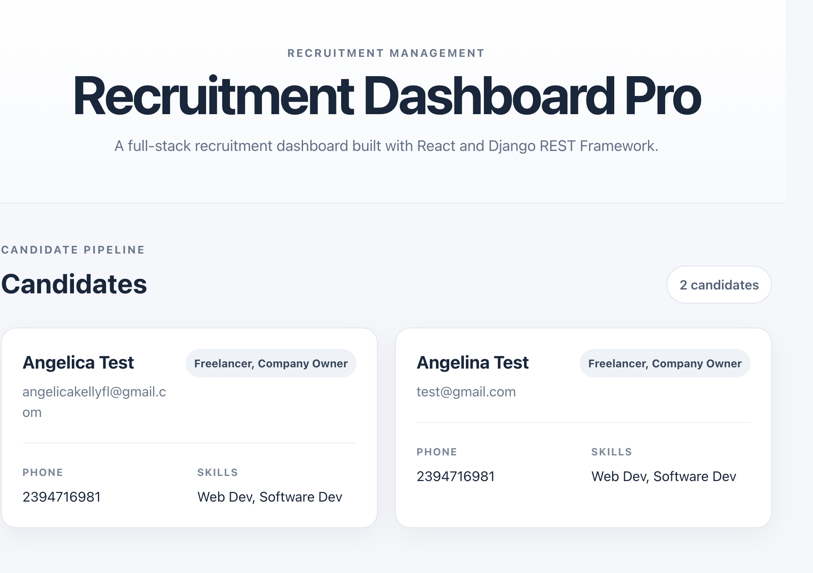

# Recruitment Dashboard Pro

Recruitment Dashboard Pro is a full-stack recruitment management application built with React and Django REST Framework.

The project demonstrates how a React frontend can consume a REST API built with Django to display and manage recruitment-related data.

## Project Status

Active development. The backend API structure and frontend integration are in place, with additional workflow and interface improvements planned.

## Current Functionality

- Candidate data model with name, email, phone number, skills, status, and creation date.
- Task model linked to candidates and assigned users.
- Social mention model for storing simulated recruiting-related mentions.
- REST API endpoints for candidates, tasks, and social mentions.
- React frontend that fetches candidate data from the Django API and displays it in the interface.

## Tech Stack

### Backend

- Python
- Django 5
- Django REST Framework
- SQLite for local development

### Frontend

- JavaScript
- React 19
- Vite
- Axios
- CSS

### Development

- Git
- GitHub


## Project Structure

```text
recruitment-dashboard-pro/
├── backend/
│   ├── api/
│   ├── core/
│   ├── manage.py
│   └── requirements.txt
└── frontend/
    ├── src/
    ├── public/
    └── package.json
```

## API Endpoints

The Django REST Framework router currently exposes endpoints for:

- `/api/candidates/`
- `/api/tasks/`
- `/api/social-mentions/`
  

## Preview




